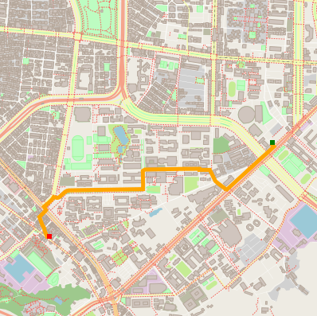

# Real Map Route Planning

This repo contains A\* Search employed in any `.osm` real map ([Map info](https://www.openstreetmap.org/)). A shortest path and corresponding distance between given any two nodes are offered.

## Example

For example, below is a route around Daan Dist, Taipei, Taiwan. between any user-defined two points.   



## Compiling and Running

### Compiling
To compile the project, first, create a `build` directory and change to that directory:
```
mkdir build && cd build
```
From within the `build` directory, then run `cmake` and `make` as follows:
```
cmake ..
make
```
### Running
The executable will be placed in the `build` directory. From within `build`, you can run the project as follows:
```
./OSM_A_star_search
```
Or to specify a map file:
```
./OSM_A_star_search -f ../<your_osm_file.osm>
```
A recommanded detailed instruction see [this document](https://github.com/dbecad/CppND-Route-Planning-Project/blob/master/Ubuntu16.4_Install.md).

## Note

This is the project provided by [CppND](https://github.com/udacity/CppND-Route-Planning-Project).

